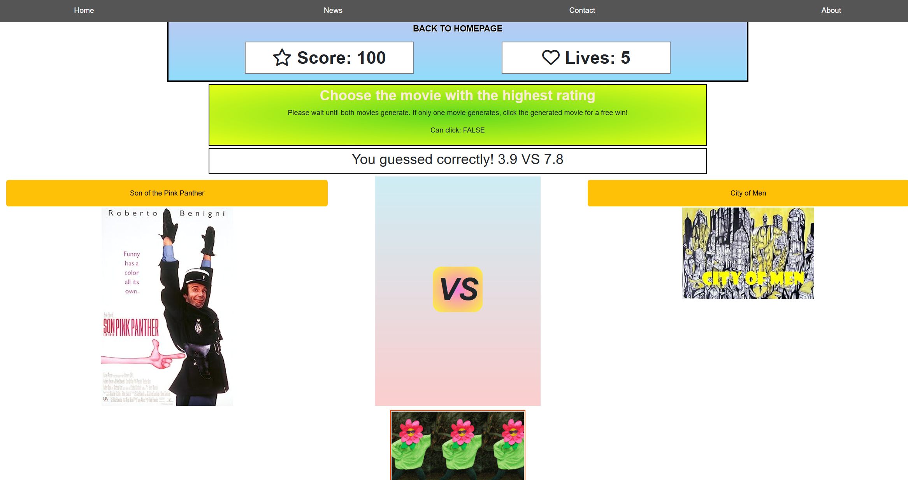

# Movie-Rating-Game

# Description

 Comparing the ratings of movies randomly generated from omdb
 Gathering basic weather data from the openweather api
 
# Installation

Open the link in a modern browser (Tested on Firefox and Chrome): https://therandommer.github.io/Movie-Rating-Game/

# Usage

When you open the site you will see the home page, similar to what is shown below. From here you can click the "Play Game" button to play the game.
High scores (if any) will be displayed in the center between the posters.
You can also delete your score data using the button at the bottom of the page.

When you are in the game, you need to correctly guess which movie has the highest rating.
Use the buttons above each movie poster to guess that film.
If you are correct you will gain +100 points.
If you are incorrect you will lose a life.
When you have 0 lives, you will lose the game and be presented with the option to submit your score
After entering 3 characters, your highscore will be saved and added to the high score list on the home page.
You can also restart the game using this UI.

## Home Page

## Game Page

## License

Using MIT License.